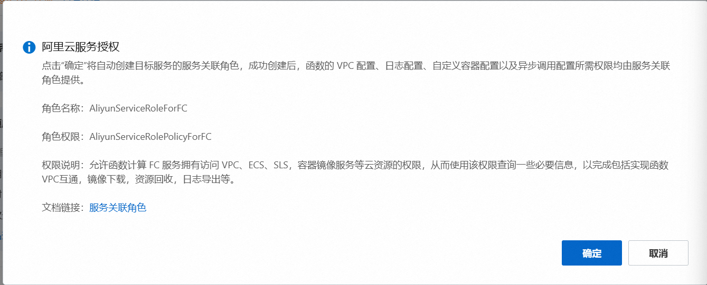

## 仿掘金网站后端

# feature

## 工程化

### 项目架构

### 代码

### 概述-后端

> 使用Vue3+TS+serverless来模仿掘金网站

### 1.需求确认

需要开发有如下页面:

- 首页
- 文章页
- 沸点页
- 个人主页
- 消息页

### 2.开发接口

#### 概述

> 确定需求之后,就需要开发接口.
>
> 使用阿里云云函数+nodejs进行接口开发,不需要熟悉后端.

#### 注册阿里云云函数

开通服务. 首次开通有3个月的优惠.



#### 创建测试服务

> 使用的是旧版'函数2.0'

1. 点击左侧菜单'服务及函数'
2. 点击<button>创建服务</button>按钮,在对话框中填写:'服务名称','服务描述','日志功能'(禁用),点击'确定'
3. 点击<button>创建函数</button>,选择'使用自定义运行时创建',然后在表单中填写:
   1. 函数名称
   2. 请求处理程序类型: '处理HTTP请求'
   3. 运行环境: 'Node.js 16'
   4. 代码上传方式: '使用示例代码'
   5. 启动命令: 'npm run start'
   6. 监听端口: '9000'
4. 配置完成以后,点击'创建'按钮

5.编写编辑器中的内容

```js
const express = require('express')
const app = express()
const port = 9000

app.get('/*', (req, res) => {
  res.send({
    code: 202,
    message: '[GET]欢迎使用云函数'
  })
})

app.listene(port, () => {
  console.log(`函数启动并监听${port}`端口)
})
```

6.测试:

6.1

6.2点击触发管理器,获取访问url,在postman中访问这个地址,获取到返参信息

注意: 需要编辑触发管理器,将'认证方式'更改为'无需认证'

### 3.Express使用介绍

#### 1.运行

#### 2.pm2监控

**是什么**
进程管理器, 解决`npm run xxx`运行后,代码修改不会立即生效问题.

**怎么做?** 1.安装

```bash
pm2 start --watch
```

2.项目根目录下创建pm2模块的配置文件`ecosystem.config.js`,添加如下内容:

```js
// ecosystem.config.js

module.exports = {
  apps: [
    {
      name: 'alifc-blog', //定义应用名称
      script: './index.js', //定义入口文件
    },
  ],
}
```

3.启动pm2
根据npm run相关命令启动pm2

```bash
pm2 start --watch
```

#### 3.使用路由创建API接口

如何创建?

```js
app.METHOD(PATH, HANDLER)
```

- METHOD: 路由方法
- PATH: 路由地址
- HANDLER: 路由处理函数

Express支持的5种路由方法:

- app.get()
- app.post()
- app.delete()
- app.put()
- app.all() 匹配有所请求

##### 1.请求对象

##### 2.响应对象

##### 3.分组路由

#### 4.中间件

**概述**

- 中间件是一个函数,有3个参数: req, res,next. next()方法的作用是进入下一个中间件.

- 使用app.use(Fn)来挂载到应用上才能使用

- app.use用法:第一个入参是路径, 第二个入参是中间件 `app.use('/test/*', myLogger)`

#### 5.统一错误处理

> 错误处理也是一个中间件.

```js
app.use((err, req, res, next) => {
  console.log(err.stack)
  res.status(500).send('服务器出错了')
})
```

注意:

- 错误处理中间件是一个'兜底'中间件,所以需要放在所有中间件的最后.
- 需要在错误中间件之前,声明一个404中间件.这俩中间件提高了健壮性.

### 4.数据库MongoDB

#### MongoDB介绍

> 文档型数据库.有3个基本概念:
>
> - 数据库(Database): 一个存储集合的仓库. MongoDB允许创建多个数据库,数据库之间互相隔离.
> - 集合(Collection): 一个数据库可以有多个集合,可将其看作数组,存储一类数据.
> - 文档(Document): 一个集合可以存储多个文档,可将其看作对象

#### MongoDB安装(8.0版本)

> https://blog.csdn.net/weixin_68256171/article/details/132337173

##### 测试

在cmd中,输入`mongsh`,即可成功运行mongodb

##### 创建目标数据库

使用use命令进入或创建还不存在的数据库

```bash
use juejin_blogs
```

创建用户名和密码

```bash
db.createUser({
	user: 'abc',
	pwd: 'abcpwd',
	roles: [
		{role:'readWrite', db:'juejin_blogs'}
	]
})
```

验证用户创建

```bash
show users
```

其他命令

```bash
//查看所有数据库
show dbs
//查看当前所在的数据库
db
//更改默认端口
在mongod.cfg中更改port的值即可
```

#### MongoDB增删改查操作

#### 使用mongoose操作数据库

**文档**

> https://mongoosejs.com/docs/

**安装依赖**

```bash
npm i mongoose -S
```

**配置文件**

```bash
//config/mongo.js

const mongoose = require('mongoose')
const connect = (req, res, next) => {
	mongoose
		.connect('mongodb://127.0.0.1:27017/juejin_blog', {
			user: 'abc',
      pass: 'abcpwd',
		})
		.then(() => {
      console.log('数据库连接成功')
      next()
    })
    .catch((err) => {
      console.log('数据库连接失败', err)
      res.status(500).send('数据库连接失败')
    })
}
```

**规范文档结构**

mongoose提供了Schema的概念,其作用是提前设定某个集合中文档的格式(有哪些字段及字段的约束).

例如

**操作文档**

### 5.后端API接口开发与部署

#### 概述

安装需求,将API开发任务分为5个部分:

- 用户管理接口
- 文章管理接口
- 沸点管理接口
- 消息与关注接口
- 项目完善和部署

#### 用户管理接口

```js
//用户注册
/create

//用户登录
/login

//用户信息修改
/update/:id

```

更新掘力值/阅读量/点赞量,不通过用户修改更新这个接口,而是通过文章操作接口完成后更新即可.

#### 文章管理接口

##### 1.分析文章功能,涉及文章需要的字段

| 字段       | 说明       | 必填 |
| ---------- | ---------- | ---- |
| title      | 标题       | √    |
| intro      | 简介       | √    |
| created_by | 作者       | 必填 |
| content    | 内容       | 必填 |
| status     | 文章状态() |      |
| tags       | 文章标签   |      |
| page_view  | 文章浏览量 |      |
| category   | 文章分类   |      |
| created_at | 创建时间   |      |
| updated_at | 更新时间   |      |
|            |            |      |

##### 2.1创建文章接口

```js
router.post('/create')
```

##### 2.2发布文章接口

```js
router.post('/publish/:id')
```

##### 3.修改与删除文章接口

```js
router.put('/put/:id')

router.delete('/remove/:id')
```

##### 4.文章点赞和收藏接口

文章的点赞和收藏存储的字段几乎一致, 同时消息中心有一个'赞和收藏'的消息列表,沸点中有点赞.

所以集中在一起.

1.点赞和收藏需要的字段

| 字段        | 说明                  |
| ----------- | --------------------- |
| target_id   | 文章或沸点的id        |
| type        | 类型 1点赞 2收藏      |
| target_type | 目标类型: 1文章 2沸点 |
| created_by  | 点赞或收藏的创建者ID  |
| created_at  | 创建时间              |

2.创建点赞和收藏的Model模型

```js

```

3.创建点赞和收藏的路由

```js
router.post('/toggle', async (req, res, next) => {})
```

##### 5.文章评论接口

文章评论与沸点评论通用,涉及一个单独的集合来存储文章和沸点的评论数据.

评论分为3类: 文章的评论, 评论的评论, 评论的评论的回复

1.设计字段. 它这里写的乱七八糟的.对应不起来

| 字段        | 说明                                          |
| ----------- | --------------------------------------------- |
| source_type | 1文章 2沸点                                   |
| type        | 评论类型: source-内容 comment-评论 reply-回复 |
| source_id   | 文章或沸点的id                                |
|             |                                               |
|             |                                               |
| content     | 评论内容                                      |
| created_by  | 评论创建者                                    |
|             |                                               |
| parent_id   | 父级评论的id                                  |
| target_user | 评论对象创建者的id (评论的评论 ??)            |
| reply_id    | 回复某个评论的id                              |
|             |                                               |
| created_at  | 创建时间                                      |

2.创建评论的接口

```js
router.post('/create', async (req, res, next) => {})
```

3.评论列表接口

```js
let commentsModel = require('../module/comments.js')

router.get('/list/:source_id', async (req, res, next) => {
  let { source_id } = req.params
  try {
    let list = await commentsModel.aggregate([
      { $match: { source_id: ObjectId(source_id) } },
      {
        $lookup: {
          from: 'users',
          localField: 'created_by',
          foreignField: '_id',
          as: 'created_by',
        },
      },
    ])

    res.send(list)
  } catch (err) {
    next(err)
  }
})
```

##### 6.文章列表接口

文章数据包括:

```js
router.get('/list', async (req, res, next) => {
  let { user_id } = req.query
  try {
    let result = await articlesModel.aggregate([
      //关联查询评论集合
      {
        $lookup: {
          from: 'comments',
          localFields: '_id',
          foreignField: 'source_id',
          as: 'comments',
        },
      },
      //关联评论集合
      {
        $lookup: {
          from: 'praises',
          localField: '_id',
          foreignField: 'target_id',
          as: 'praises',
        },
      },
    ])

    res.send(result)
  } catch (err) {
    next(err)
  }
})
```

#### 3项目完善和部署

#### 1.通用配置

包含: JWT登录验证; 分页查询列表;

##### 登录验证

登录验证通常的解决方案是JWT,就是将用户信息加密后生成token令牌,请求接口时在请求头中配置携带. 需要使用第三方的express-jwt来实现该逻辑.

安装

```bash
npm i express-jwt
```

创建utils/jtw.js

编写生成token和验证token的两个方法并导出

```js
const { exporessjwt: exjwt } = require('wxperss-jwt')

let jwt = require('jsonwebtoken')

//密钥
const SECRET_KEY = 'alifn_jueblog_jwt_8756'
//生成JWT
function geneJWT(data) {
  let token = jwt.sign(data, SECRET_KEY, { expiresIn: '7d' })
  return token
}

//验证jwt
function verfiyJWT() {
  return exjwt({
    secret: SECRET_KEY,
    algorithms: ['HS256'],
    requestProperty: 'auth',
  })
}

module.exports = {
  genoJWT,
  verifyJWT,
}
```

#### 2.统一使用分页查询列表

#### 3.统一处理路由异常

1.路由中的错误处理, 使用next(err)

2.在路由错误中间件中统一处理错误

```js
//index.js

app.use((err, req, res, next) => {
  let err400 = ['ValidationError', 'CastError']
  let code = err400.includes(err.name) ? 400 : err.status || 500
  res.status(code).send({
    name: err.name,
    message: err.message,
  })
})
```

### 将代码发布到云函数

## 前端

### 1.创建项目

1.创建选项

```bash
npm create vue@3
```

选择TS,JSX,VueRouter,Pinia

2.安装UI框架及其他三方必要依赖

axios, element-plus, less, dayjs

```bash
npm i axios element-plus, less, dayjs
```

element-plus需要在main.js中引入

```ts
// src/main.ts
import ElementPlus from 'element-plus'
...

app.use(ElementPlus)
```

3.优化项目目录结构

```ui
- assets 静态资源目录,存放图片,文字
- components 组件目录,存放公共组件
- router 路由目录,存放路由的配置
- stores 状态管理目录,存放Pinia仓库
- pages 页面目录,存放页面级别的组件
- utils 工具函数目录,存放自定义函数
- styles 样式目录,存放全局样式文件
- reqeust 请求目录, 存放axios全局请求对象
- App.vue 根组件,页面最外层的结构
- main.ts 入口文件, 在该文件中创建Vue app
```

### 2.添加全局样式和代码规范配置

全局样式包含全局UI样式, 公共样式封装和CSS变量定义等.

代码规范主要用于配置格式化风格和设置保存自动格式化.

#### 1.全局样式

全局样式的作用:

- 统一修改某些元素或UI组件的默认样式
- 封装公共类
- 加载其他样式

##### 1.位置定义

- 创建`styles/main.less`,定义全局样式
- 创建`styels/variable.css`,定义CSS变量

##### 2.引入使用

- 将其他样式文件引入到`main.less`中

- 将`main.less`导入到入口文件`main.ts`中

```less
// src/styles/main.less
@import 'element-plus/dist/index.css' @import './variable.css';
```

```ts
// src/main.ts
import ./styles/main.less
```

##### 3.使用

- 使用UI组件样式
- 使用变量

```vue
<style lang="less">
span {
  color: var(--el-color-primary);
}
</style>
```

#### 2.代码规范

这里简述一下, 使用`eslint, commitlint, .vscode/settings.json, commitizen, git-cz`来实现代码格式化和提交的格式化.

具体可以查看: [[前端工程化概览#3.检测和统一规范]]

### 3.添加统一路由及请求的配置

VueRouter配置,及axios配置

#### 3.1 路由配置

创建基础路由框架以后,Vue使用这个插件.

##### 1.创建`router/index.ts`

```ts
import { createRouter, createWebHistory } from 'vue-router'
import routes from './routes'

const router = createRouter({
  history: createWebHistory(import.meta.env.BASE_URL),
  routes,
})
```

##### 2.创建`router/routes.ts`

定义路由配置数组,例如

```ts
// src/router/routes.ts

import HomeView from '@/pages/home/index.vue'

const routes = [
  {
    path: '/',
    component: HomeView,
    name: 'home',
  },
]

export default routes
```

#### 3.2 请求配置

创建axios的实例,添加请求拦截器和响应拦截器. 这个配置非常的简陋.

这里需要回顾一下前端请求的流程:

```md
- 发起请求
- 请求参数处理
- 请求拦截
  - 添加请求头
  - 添加用户标识
- 发起请求
- 响应拦截
  - 网络错误处理
  - 授权错误处理
  - 普通错误处理
  - 请求完成
- 返回参数处理
```

### 4.添加mock配置

使用strapi创建模拟请求的后端.来对数据进行增删改查操作.

### 5.开发全局公共组件

掘金网站的页面布局是上下结构, 所以根组件也要分成上下结构.

#### 1.根组件App.vue

#### 2.头部组件components/cus-header

文件构成:
消息弹框子组件, 用户弹窗子组件

```md
- cus-header
  - index.vue //头部组件
  - message.vue //消息弹窗组件
  - user.vue //用户弹窗组件
```

#### 3.登录组件

#### 4.编辑器组件

使用开源编辑器项目: bytemd

> [pd4d10/bytemd: ByteMD v1 repository](https://github.com/pd4d10/bytemd#readme)

安装插件

```bash
npm i @bytemd/vue-next @bytemd/plugin-gfm @bytemd/plugin-highlight @bytemd/plugin-medium-zoom @bytemd/plugin-mermaid
```

创建编辑器组件`components/cus-editor/index.vue`

```vue
<
```

可以单独封装成一个组件,作为一个npmjs包使用.  
可以参考: [21st.dev – The NPM for Design Engineers](https://21st.dev/)

#### 5.首页各部分

#### 5.1 文章分类

需要先获得文章分类的数据: 定义文章store存储该数据,再创建组件并关联数据. 1.创建首页左侧的文章分类组件`pages/home/nav.vue` 2.创建文章列表子组件 `pages/home/articles.vue`

#### 文章详情页

文章详情页包括markdown渲染, 点赞, 收藏, 评论及目录解析等功能.该页面采用左中右布局, 分别是操作模块, 内容模块, 目录模块.

##### 1.在文章store中获取文章详情/点赞/取消点赞/收藏/取消收藏的方法

- `stores/article/index.ts => getArticlesDetail`

##### 2.创建文章详情组件

- `pages/article/detail.vue`

##### 3.开发md文档渲染组件

1. 安装showdown的相关依赖

```bash
npm i showdown showdown-highlight
```

2. 创建`components/mk-render/index.vue`

```vue
<article className="cus-mk-render" v-html="content"></article>
```

3. 编写组件的JS内容及样式.

以上就是基本步骤

##### 4.开发文章内容展示模块

引入创建的渲染组件,

detail组件中添加内容模块的模板代码

##### 5.开发文章作者和目录模块

detail组件中添加文章作者和目录模块

#### 用户中心页

##### 1.开发用户基本信息模块

- 用户中心页面 `pages/user/index.vue`及路由创建
  - 组件左侧-个人信息模块,展示用户的基本信息, 拥有'编辑'按钮

##### 2.展示用户的文章和沸点数据

##### 3.用户的个人成就模块

页面右侧展示个人成就,包括点赞量,阅读量和掘力值等

#### 开发消息中心页

##### 1.开发消息类型tab标签

1.创建文件`pages/messages/index.vue`,并添加路由

2.编写模板代码,根据状态判断某个标签是否已被选中,当有未读消息时展示未读消息的数量

3.在stores中添加getComments方法, getPraises,getFollows方法,分别获取评论消息,获取点赞与收藏消息和获取关注消息.

##### 2.开发消息列表模块

消息列表随着

#### 开发文章发布编辑页

##### 1.导入编辑器,编写页面基本结构

- 创建文件`pages/articles/operate.vue`, 并添加路由
- 添加页面模板及页面逻辑

##### 2.添加发布弹框,编辑发布选项

- 定义组件
- 添加创建/更新/发布文章的相关方法
- 完成业务代码

##### 3.监听文本编辑,实现自动保存

自动保存文章需要监听文本修改事件,同时要控制自动保存的触发频率,因此需要一个防抖函数.

- 在`utils/index.ts`中添加一个防抖函数
- 在组件中导入防抖函数,并实现自动保存的`ctxChange`方法

#### 开发沸点页

##### 1.开发沸点圈子组件

- 创建`store/short-msg/index.ts`, 定义并存储沸点列表数据和沸点圈子数据
- 组件中添加创建沸点/删除沸点/点赞和取消沸点

##### 2.开发沸点列表组件,展示和操作沸点

- 创建`pages/short-msg/lists.vue`, 表示公共沸点列表组件
- 编写业务逻辑, 导入沸点store, 定义props和自定义事件

##### 3.开发沸点入口组件,新增创建沸点模块

- 创建`pages/short-msg/index.vue`表示沸点入口组件,并添加路由配置
- 组件中编写创建沸点的模块, 主要用来提供一个内容输入框和一个发布沸点的按钮
- 编写业务逻辑代码
